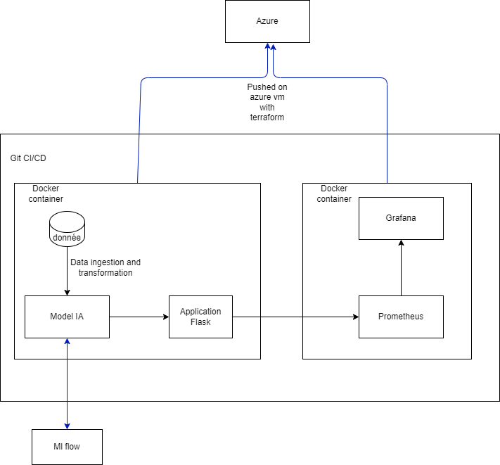

# Projet MLOps - Déploiement Automatisé d'une Solution ML

## Introduction

Ce projet vise à mettre en place une chaîne complète MLOps en intégrant les pratiques DevOps et les outils spécifiques au Machine Learning, en utilisant une approche d'Infrastructure as Code (IaC) et de CI/CD. Le projet est réalisé par un groupe de 3 étudiants et doit être rendu le 20 décembre 2024.

## Technologies Utilisées

- **Conteneurisation** : Docker
- **IaC** : Terraform
- **Configuration** : Ansible
- **Cloud** : Azure
- **ML Tracking** : MLflow
- **CI/CD** : GitHub Actions
- **Monitoring** : Prometheus + Grafana

## Installation

### Prérequis

- Docker
- Terraform
- Ansible
- Python 3.9
- Git
- Azure

### Étapes d'Installation en Local

1. **Cloner le Repository** :

   ```bash
   git clone https://github.com/Hostilemystery/automated_deployment_of_an_ml_solution.git
   cd automated_deployment_of_an_ml_solution
   ```

2. **Construire les Conteneurs** :

   ```bash
   docker-compose build
   ```

3. **Lancer les Conteneurs** :

   ```bash
   docker-compose up
   ```

   - **Application Flask** : [http://localhost:8080](http://localhost:8080)
   - **Prometheus** : [http://localhost:9090](http://localhost:9090)
   - **Grafana** : [http://localhost:3000](http://localhost:3000)
     - **Nom d'utilisateur** : admin
     - **Mot de passe** : test

4. **Arrêter les Conteneurs** :

   ```bash
   docker-compose down
   ```

### Étapes d'Installation sur le Cloud

## Architecture de l'Application

Nous avons mis en place une architecture robuste pour notre application, qui intègre plusieurs composants clés pour assurer une gestion efficace des données, une modélisation performante, et un déploiement fluide. Voici comment nous avons structuré notre architecture :



### Pipelines d'Ingestion, de Transformation et de Modélisation

Nous avons développé des pipelines automatisés pour l'ingestion des données, leur transformation et la modélisation. Ces pipelines gèrent le flux de données depuis leur source jusqu'à la création du modèle de machine learning.

### Modèle de Machine Learning

Une fois le modèle entraîné, nous le passons à notre application Flask pour effectuer des prédictions. Les métriques du modèle sont enregistrées et suivies via MLflow, ce qui nous permet de surveiller les performances et la précision de notre modèle.

### Conteneurisation

Nous avons conteneurisé notre application Flask et la partie machine learning en utilisant Docker. Cela nous permet d'encapsuler ces composants, facilitant ainsi leur déploiement et leur gestion.

### Monitoring avec Grafana et Prometheus

Pour le monitoring de notre application, nous utilisons Grafana et Prometheus, également déployés dans des conteneurs séparés. Grafana nous permet de visualiser les métriques collectées par Prometheus, ce qui nous donne une vue d'ensemble des performances et de la santé de notre application.

### Déploiement sur Azure avec Terraform

Pour déployer notre application sur Azure, nous utilisons Terraform. Cet outil d'infrastructure as code (IaC) nous permet de définir et de provisionner des ressources cloud de manière automatisée et reproductible.

### Gestion du Code et CI/CD

Notre code est disponible sur GitHub. Nous avons mis en place un pipeline CI/CD (Continuous Integration/Continuous Deployment) pour automatiser les tests, l'intégration et le déploiement de notre application. Cela garantit que chaque modification du code est testée et déployée de manière fluide et sans interruption.

### Résumé de Notre Architecture

- **Pipelines de Données** : Ingestion, transformation et modélisation.
- **Modèle de Machine Learning** : Intégré dans une application Flask pour les prédictions, avec suivi des métriques via MLflow.
- **Conteneurisation** : Utilisation de conteneurs pour l'application Flask et la partie machine learning.
- **Monitoring** : Grafana et Prometheus pour la surveillance, également déployés dans des conteneurs.
- **Déploiement** : Utilisation de Terraform pour déployer sur Azure.
- **Gestion du Code** : Code disponible sur GitHub avec un pipeline CI/CD pour l'automatisation des tests et du déploiement.

Cette architecture nous permet de gérer efficacement les données, de réaliser une modélisation robuste, de déployer automatiquement notre application, et de surveiller en temps réel les performances et la santé de notre système. De plus, l'intégration continue et le déploiement continu assurent la qualité et la fiabilité de notre application.

## Documentation des API

Cette documentation décrit les API disponibles pour notre application Flask. L'application utilise Flask pour gérer les requêtes HTTP et Prometheus pour le monitoring. Les API permettent de faire des prédictions basées sur un modèle de machine learning et de lancer l'entraînement du modèle.

### Endpoints

### 1. Home (Prédiction)

- **URL** : `/`
- **Méthodes** : `GET`, `POST`
- **Description** : Cet endpoint permet de faire des prédictions basées sur les données fournies.

#### Requête POST

- **Paramètres** :

  - `fixed_acidity` (float) : Acidité fixe.
  - `volatile_acidity` (float) : Acidité volatile.
  - `citric_acid` (float) : Acide citrique.
  - `residual_sugar` (float) : Sucre résiduel.
  - `chlorides` (float) : Chlorures.
  - `free_sulfur_dioxide` (float) : Dioxyde de soufre libre.
  - `total_sulfur_dioxide` (float) : Dioxyde de soufre total.
  - `density` (float) : Densité.
  - `pH` (float) : pH.
  - `sulphates` (float) : Sulfates.
  - `alcohol` (float) : Alcool.

- **Réponse** :
  - **Succès** :
    ```json
    {
      "prediction": <prediction_value>
    }
    ```
  - **Erreur** :
    ```json
    {
      "error": "Invalid input or prediction error."
    }
    ```

#### Requête GET

- **Description** : Rend le template HTML de la page d'accueil.

### 2. Train (Entraînement du Modèle)

- **URL** : `/train`
- **Méthodes** : `GET`
- **Description** : Cet endpoint lance l'entraînement du modèle de machine learning.

- **Réponse** :
  ```json
  {
    "message": "Model training successful!"
  }
  ```

### 3. Metrics (Métriques)

- **URL** : `/metrics`
- **Méthodes** : `GET`
- **Description** : Cet endpoint expose les métriques de l'application pour le monitoring avec Prometheus.

- **Réponse** :
  ```plaintext
  # HELP python_gc_objects_collected_total Objects collected during GC
  # TYPE python_gc_objects_collected_total counter
  python_gc_objects_collected_total{generation="0"} 2345.0
  python_gc_objects_collected_total{generation="1"} 1234.0
  python_gc_objects_collected_total{generation="2"} 567.0
  ```

### 4. Health (Santé de l'Application)

- **URL** : `/health`
- **Méthodes** : `GET`
- **Description** : Cet endpoint vérifie la santé de l'application et retourne un statut.

- **Réponse** :
  ```json
  {
    "status": "healthy"
  }
  ```

## Déploiement sur le Cloud

### Étapes d'Installation sur Azure

1. **Configurer Terraform** :

   ```bash
   terraform init
   ```

2. **Planifier le Déploiement** :

   ```bash
   terraform plan
   ```

3. **Appliquer le Déploiement** :

   ```bash
   terraform apply
   ```

4. **Détruire les Ressources** :

   ```bash
   terraform destroy
   ```

## Conclusion

Ce projet MLOps intègre les meilleures pratiques DevOps et les outils spécifiques au Machine Learning pour créer une chaîne de déploiement automatisée et robuste. En utilisant Docker, Terraform, Ansible, Azure, MLflow, GitHub Actions, Prometheus et Grafana, nous avons construit une architecture qui assure une gestion efficace des données, une modélisation performante, un déploiement fluide et un monitoring en temps réel.

## Contributions

Ce projet est réalisé par un groupe de 3 étudiants(NANJI ENGA Gedeon Freddy, CORMEAUX ANthony, IBOBI SAMBILA Osée Gildas). Pour toute question ou suggestion, n'hésitez pas à nous contacter via notre repository GitHub : [automated_deployment_of_an_ml_solution](https://github.com/Hostilemystery/automated_deployment_of_an_ml_solution).
